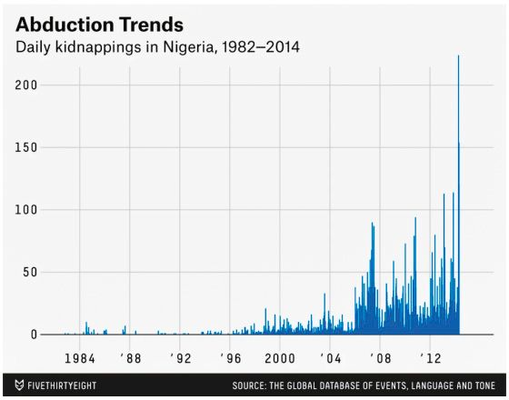

# Markdown Report
## By Stephanie Tsai
*April 7, 2022*

## Data Viz Summary :bar_chart:
The data visualization is a graph made by *FiveThirtyEight* to accompany their own data-driven story about the rate of kidnapping girls in Nigeria is reaching an all-time high. There, the visualization showcases the daily kidnappings incidents happening in Nigeria from 1982 to 2014. However, the information presented in the graph was using media reports asA its data source rather than the number of events that actually happened. This chart also raised suspects challenging the accuracy of big data and algorithms as the report may be counting some events and some media reports. Even until now, people still do not know the trustworthiness of the data.

## Data Viz Biography :pushpin:

1. **Who or what institution produced the visualization?** FiveThirtyEight produced and published the visualization.
2. **When was it produced?** It was produced in April 2014.
3. **Who is the audience for the visualization? Who might be impacted, either directly or indirectly, by the visualization?** The primarily audience is for the readers who read blogs published by *FiveThirtyEight*. The usage of [GDELT](https://www.gdeltproject.org/) (Global Database of Events, Language and Tone) will be directly impacted because it is what *FiveThirtyEight* used for their primary data source so people may interpret it as untrustworthy and spreading inaccurate data. Additionally, people who are responsible for producing and publishing content on *FiveThirtyEight* will also be directly impacted because they did not double check the source of the data, leading to the error found in their chart. On the other hand, a group of audience who may be indirectly impacted by the visualization are data scientists. This graph would remind them the importance of understanding the context before approaching any new source of knowledge and any functional limitations of data.
4. **What values, goals, or interests are at stake with the visualization?**  The accuracy and trust are at stake with the visualization because it did not include all abduction incidents.
5. **What can be learned from the visualization?** Viewers are able to learn that the number of daily abduction incident in Nigeria has been increasing and worsening since 1982 to 2014.
6. **What issues, if any, related to power and justice are reflected in the data visualization?** One of the main issue reflected in the data visualization is that a lot of abduction may be neglected as they are not even on public record. There are so many kidnapping events that happened in a day but GDELT duplicated some stories to a single event or recorded them based on media reports. Additionally, the data visualization also raised the sad reality of the increase rate of kidnapping happening in Nigeria and places around us.
